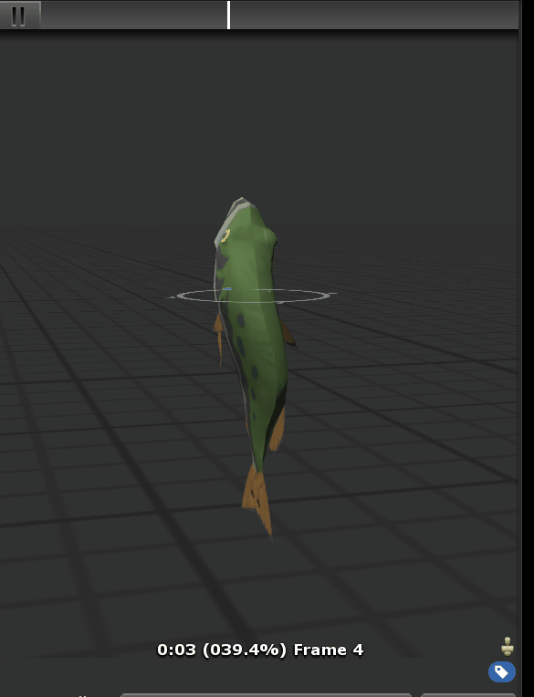

# Automated SBFRES Extractor for Zelda BotW #

## Disclaimer ##

Avoid distributing the resulting models from implementing this tool, as they are copyrighted by Nintendo and you will be subject to such laws.  Personal use ONLY!

## Proof of Concept ##

  

## Dependencies ##

 - Windows.  I am a Mac user through and through, but you really don't have a choice on this one, as all of the code has been previously developed for Windows.  I used 10, but 7 or 8 might work as well (try VirtualBox or Parallels if you don't want to dual boot).  
 - Python 3.x.x, you can get it by installing [Scoop](http://scoop.sh/) and then installing python3, or by downloading it from [Python.org](python.org)
 - Python 2.7, if you want to use the PACK extractor (which is part of the CompleteAutomation.py script).  
 - 3DSMax (preferably 2015).  I would prefer Blender honestly but the best scripts have been made for 3DSMax, and it isn't a bad tool ignoring the hefty price tag.  
 - This repository's contents (duh)
 - PyCharm, if you want to edit.  Since there is a free version, I suggest editing with that over another IDE.  

 
 ## Python Install ##
 I suggest doing the following instead of using the online installers: 
 1. In powershell, install scoop as follows: `iex (new-object net.webclient).downloadstring('https://get.scoop.sh')`.  
 2. Run `scoop install python` to install Python 3.x
 3. Run `scoop bucket add versions` and then `scoop install python27` in order to install Python 2.7.

## Implementation ##

First, you'll need the models found by extracting your Wii U disc's content.  This can be done with a number of existent tools, but I'll let you make the decision.  
Then, clone this repository in SourceTree or extract the downloaded ZIP archive.  Then run `cd /extracted/project/copy`, and finally, `python3 RunMe.py`. This should take care of everything, and after about a day or so (it'll probably take that long), you can open the FBX files in fbxextraction/.  For a more in-depth analysis of how it works, look at the next section.  

## Automation ##

The tool works as follows.  
 - Copies all of the SBFRES files in your extracted game resources to the Compilation subdirectory within the project.  
 - Looks through the entire folder and internally registers each model.sbfres with its model.Tex1.sbfres counterpart, files which contain the geometry and textures of the model respectively.  
 - For every file, 
    - It extracts each SBFRES archive with yaz0dec.exe, leaving two RARC files.  
    - The geometry RARC is renamed to geometry.BFRES.  
    - The texture RARC is extracted with QuickBMS and couple scripts that RTB developed, leaving some GTX files.  
    - The GTX files are then converted into DDS files with TexConv2.  
    - The DDS files are then converted into PNG files with ImageMagick.  
    - The files are placed into the corresponding subdirectory.  
 - Then, the models have to be exported to FBX.  
 - So, a new Python script is called which takes care of everything except the model loading itself.  This is done with a custom MAXScript I wrote (which is a modification of BFRES Script_R4.ms).  
 - For every BFRES database subdirectory, 
    - my Python script sets up a new workspace with a model file (of the same path every time)
    - the MAXScript loads the file and then fixes the model so that it will work better with Unity (rotation along the X axis by 90 degrees, Units change, etc.) before exporting it to the workspace in FBX format.  
    - the Python script takes both FBX files and stores them in the database, before starting the next model export.  
 - These files are then easily opened in Unity :)
